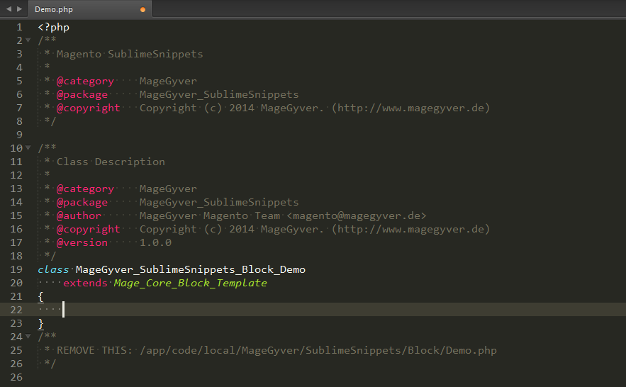

Magento Snippets for Sublime Text
=================================

Snippets for daily work with Magento in Sublime Text (www.sublimetext.com/).

See also the blogpost on www.magegyver.de:
* http://www.magegyver.de/mageclass-sublime-text-snippet-fuer-magento-klassen/ (German)

## Magento Class (`mageclass`)

Generates an empty PHP class for current namespace and module, extending `Mage_Core_Block_Template` by default.

### How To

* create the new file in the location where you need it, for example `/app/code/local/MageGyver/SublimeSnippets/Block/Demo.php` (don't forget to save it)
* type `mageclass` and hit `tab`
* code for your new class will be created with vendor and module name the file belongs to

